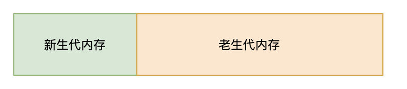
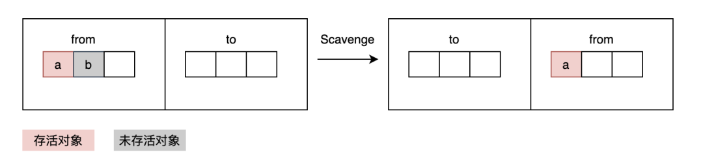
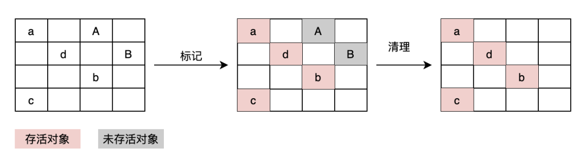
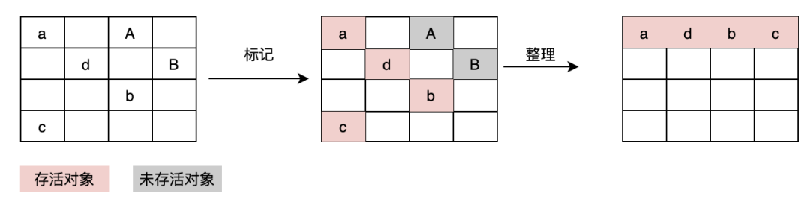
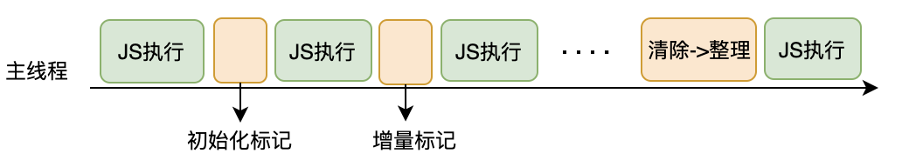

# 浏览器垃圾回收机制
JavaScript引擎的内存空间主要分为栈和堆。

## 栈
栈是临时存储空间，主要存储局部变量和函数调用。

基本类型数据（Number, Boolean, String, Null, Undefined, Symbol, BigInt）保存在在栈内存中。引用类型数据保存在堆内存中，引用数据类型的变量是一个指向堆内存中实际对象的引用，存在栈中。

为什么基本数据类型存储在栈中，引用数据类型存储在堆中？

JavaScript引擎需要用栈来维护程序执行期间的上下文的状态，如果栈空间大了的话，所有数据都存放在栈空间里面，会影响到上下文切换的效率，进而影响整个程序的执行效率。

## 堆
堆空间存储的数据比较复杂，大致可以划分为下面 5 个区域：代码区（Code Space）、Map 区(Map Space)、大对象区（Large Object Space）、新生代（New Space）、老生代（Old Space）。
其他几个不重要，关键是新生代（内存）和老生代（内存）。

新生代内存是临时分配的内存，存活时间短，老生代内存是常驻内存，存活时间长。


### 新生代内存回收
新生代中用 Scavenge 算法来处理。所谓 Scavenge 算法，是把新生代空间对半划分为两个区域，一半是对象区域（from），一半是空闲区域 (to)。

新的对象会首先被分配到 from 空间，当进行垃圾回收的时候，会先将 from 空间中的 存活的对象复制到 to 空间进行保存，对未存活的对象的空间进行回收。复制完成后， from 空间和 to 空间进行调换，to 空间会变成新的 from 空间，原来的 from 空间则变成 to 空间。这种算法称之为 ”Scavenge“。

新生代内存回收频率很高，速度也很快，但是空间利用率很低，因为有一半的内存空间处于"闲置"状态。

### 老生代内存回收
新生代中多次进行回收仍然存活的对象会被转移到空间较大的老生代内存中，这种现象称为晋升。以下两种情况

+ 在垃圾回收过程中，发现某个对象之前被清理过，那么将会晋升到老生代的内存空间中
+ 在 from 空间和 to 空间进行反转的过程中，如果 to 空间中的使用量已经超过了 25% ，那么就将 from 中的对象直接晋升到老生代内存空间中。

因为老生代空间较大，如果仍然用 Scavenge 算法来频繁复制对象，那么性能开销就太大了。

#### 标记-清除（Mark-Sweep）
老生代采用的是”标记清除“来回收未存活的对象。

分为标记和清除两个阶段。标记阶段会遍历堆中所有的对象，并对存活的对象进行标记，清除阶段则是对未标记的对象进行清除。


#### 标记-整理（Mark-Compact）
标记清除不会对内存一分为二，所以不会浪费空间。但是经过标记清除之后的内存空间会生产很多不连续的碎片空间，这种不连续的碎片空间中，在遇到较大的对象时可能会由于空间不足而导致无法存储。为了解决内存碎片的问题，需要使用另外一种算法 - 标记-整理（Mark-Compact）。标记整理对待未存活对象不是立即回收，而是将存活对象移动到一边，然后直接清掉端边界以外的内存。


#### 增量标记
为了避免出现JavaScript应用程序与垃圾回收器看到的不一致的情况，进行垃圾回收的时候，都需要将正在运行的程序停下来，等待垃圾回收执行完成之后再回复程序的执行，这种现象称为“全停顿”。如果需要回收的数据过多，那么全停顿的时候就会比较长，会影响其他程序的正常执行。


为了避免垃圾回收时间过长影响其他程序的执行，V8将标记过程分成一个个小的子标记过程，同时让垃圾回收和JavaScript应用逻辑代码交替执行，直到标记阶段完成。我们称这个过程为增量标记算法。


通俗理解，就是把垃圾回收这个大的任务分成一个个小任务，穿插在 JavaScript任务中间执行，这个过程其实跟 React Fiber 的设计思路类似。


# JS十大排序算法
1. 冒泡排序
冒泡排序的特点，是一个个数进行处理。
```
function bubbleSort(arr){
	const len = arr.length;
	for(let i = 0; i < len - 1; i++){
		for(let j = 0; j < len - i - 1; j++){
			if(arr[j] > arr[j+1]){
				const tmp = arr[j+1];
				arr[j+1] = arr[j];
				arr[j] = tmp;
			}
		}
	}
 
	return arr;
}
```
2. 快速排序
快速排序，使用的是分治法的思想。
通过选定一个数字作为比较值，将要排序其他数字，分为 >比较值 和 <比较值，两个部分。并不断重复这个步骤，直到只剩要排序的数字只有本身，则排序完成。
```
function quickSort(arr){
 
	sort(arr, 0, arr.length - 1);
	return arr;
 
 
	function sort(arr, low, high){
		if(low >= high){
			return;
		}
	
		let i = low;
		let j = high;
		const x = arr[i]; // 取出比较值x，当前位置i空出，等待填入
		while(i < j){
			// 从数组尾部，找出比x小的数字
			while(arr[j] >= x && i < j){
				j--;
			}
			// 将空出的位置，填入当前值， 下标j位置空出
			// ps：比较值已经缓存在变量x中
			if(i < j){
				arr[i] = arr[j]
				i++;
			}
 
			// 从数组头部，找出比x大的数字
			while(arr[i] <= x && i < j){
				i++;
			}
			// 将数字填入下标j中，下标i位置突出
			if(i < j){
				arr[j] = arr[i]
				j--;
			}
			// 一直循环到左右指针i、j相遇，
			// 相遇时，i==j, 所以下标i位置是空出的
		}
 
		arr[i] = x; // 将空出的位置，填入缓存的数字x，一轮排序完成
 
		// 分别对剩下的两个区间进行递归排序
		sort(arr, low, i - 1);
		sort(arr, i+1, high);
	}
}
```

3. 希尔排序
希尔排序是一种插入排序的算法，它是对简单的插入排序进行改进后，更高效的版本。由希尔（Donald Shell）于1959年提出。
特点是利用增量，将数组分成一组组子序列，然后对子序列进行插入排序。
由于增量是从大到小，逐次递减，所以也称为缩小增量排序。
```

function shellSort(arr){
	// 分组规则 gap/2 递减
	for(let gap = Math.floor(arr.length/2); gap > 0; gap = Math.floor(gap/2)){
		for(let i = gap; i < arr.length; i++){
			let j = i;
			// 分组内数字，执行插入排序，
			// 当下标大的数字，小于 下标小的数字，进行交互
			// 这里注意，分组内的数字，并不是一次性比较完，需要i逐步递增，囊括下个分组内数字
			while(j - gap >= 0 && arr[j] < arr[j - gap]){
				swap(j, j-gap);
				j = j - gap;
			}
		}
	}
 
	return arr;
 
	function swap(a, b){
		const tmp = arr[a];
		arr[a] = arr[b];
		arr[b] = tmp;
	}
}
```

4. 选择排序
```
function selectionSort(arr){
	const len = arr.length;
 
	for(let i = 0; i < len-1; i++){
		let minIndex = i;
		for(let j = i+1; j < len; j++){
			if(arr[j] < arr[minIndex]){
				minIndex = j; // 保存最小数的下标
			}
		}
 
		const tmp = arr[i];
		arr[i] = arr[minIndex];
		arr[minIndex] = tmp;
	}
 
	return arr;
}
```

5. 并归排序
归并排序，利用分治思想，将大的数组，分解为小数组，直至单个元素。然后，使用选择排序的方式，对分拆的小数组，进行回溯，并有序合并，直至合并为一个大的数组。
```
function mergeSort(arr){
 
	return sort(arr, 0, arr.length - 1); // 注意右区间是arr.length - 1
 
	// sort方法，进行递归
	function sort(arr, left, right){
		
		// 当left !== right时，证明还没分拆到最小元素
		if(left < right){
			// 取中间值，分拆为两个小的数组
			const mid = Math.floor((left+right) / 2);
			const leftArr = sort(arr, left, mid);
			const rightArr = sort(arr, mid+1, right);
			// 递归合并
			return merge(leftArr, rightArr)
		}
 
		// left == right, 已经是最小元素，直接返回即可
		return left >= 0 ? [arr[left]] : [];
	}
 
	// 合并两个有序数组
	function merge(leftArr, rightArr){
		let left = 0;
		let right = 0;
		const tmp = [];
 
		// 使用双指针，对两个数组进行扫描
		while(left < leftArr.length && right < rightArr.length){
			if(leftArr[left] <= rightArr[right]){
				tmp.push(leftArr[left++]);
			}else{
				tmp.push(rightArr[right++]);
			}
		}
 
		// 合并剩下的内容
		if(left < leftArr.length){
			while(left < leftArr.length){
				tmp.push(leftArr[left++]);
			}
		}
 
		if(right < rightArr.length){
			while(right < rightArr.length){
				tmp.push(rightArr[right++]);
			}
		}
 
		return tmp;
	}
 
}
```
